# 目录
[TOC]

------------
# 1. 样本信息
文件名称：C:\Users\Administrator\Desktop\b.exe
文件大小：262913 字节
修改时间：2017年2月22日 14:40:01
MD5     ：0C1BC5B8A8DFE0424030D419AB5C2F8A
SHA1    ：1BDF29827DADA442357C482A9E086DC3AE166728
CRC32   ：F3CDDB62

PEiD识别不出编译语言和编译器版本，应该是经过加壳的文件。
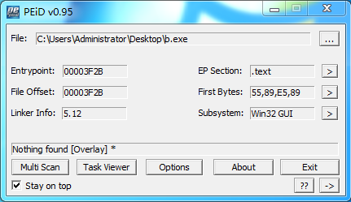

# 2. 病毒流程
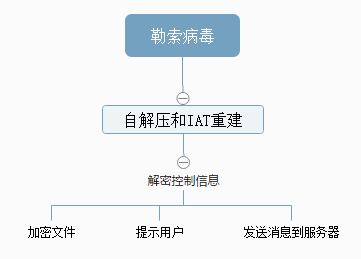
主要线程：
1.关闭某些进程，如sqlserver.exe，这样才能加密并删除数据库文件。
2.创建N个线程，扫描磁盘文件，获取可加密文件列表。
3.创建N个线程，用于加密文件，具体线程数根据本机的配置。
4.创建一个隐藏窗口，用于通知加密完毕。
5.修改主机桌面背景，打开提示文件并显示。
6.主线程等待执行完上述操作后，等待窗口结束。

# 3 病毒分析
## 3.1 自解压和IAT重建
病毒使用了加壳技术对自身进行了加密，同时还进行了混淆，增加了静态分析的难度，这里我跳过了壳的分析，手动脱壳到病毒的OEP。
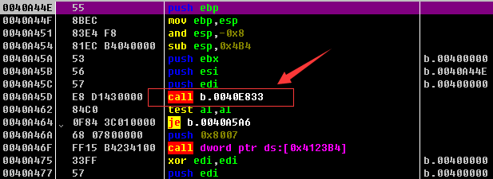

这时候把程序dump下来会发现系统的API都看不到，因为程序并没有直接调用API，而已通过一个全局函数数组，通过上图函数加载函数地址并写入的全局函数数组中。程序其他地方直接调用全局函数数组中的函数。
这里dump有两个选择，一个是直接dump，不过因为混淆，增加静态分析的难度，另外一个做法就是执行完混淆还原部分，然后把混淆的函数调用给nop掉，接着dump下来，然后通过工具修复了IAT表，这样方便我后续使用IDA进行静态分析（本文采用了第二种）。

## 3.2 解密配置信息
接着程序运行起来了，程序获取自己的模块句柄和文件路径后，接着使用RC4算法解密获取配置信息，这部分同一放在一个函数中（另命名为f_DecryptConfigInfo）执行，该部分配置信息控制病毒后续行为和操作。
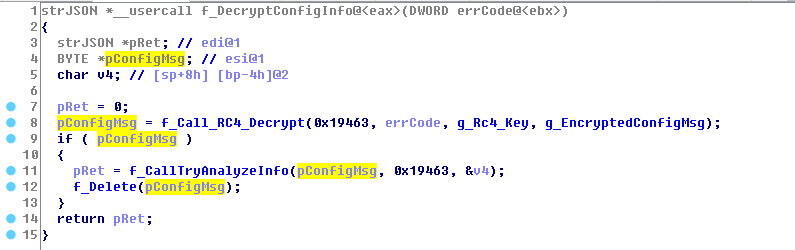

解密后的控制信息是一个json格式的文本，包含以下部分：

### 3.2.1 黑名单
包含感染文件类型黑名单、某些特定文件和特定目录以及部分使用地区。
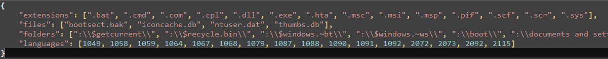

### 3.2.2 关闭进程
可以看出主要是某些大众应用和数据库服务进程，关闭这些进程的目的是为了避免文件被占用导致加密操作失败。
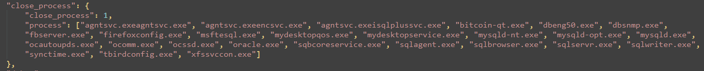

### 3.2.3 加密设置
包含加密文件后缀，文件大小，是否启动多线程，核心线程数等等，不过部分参数会根据感染主机的情况进行适度调整。
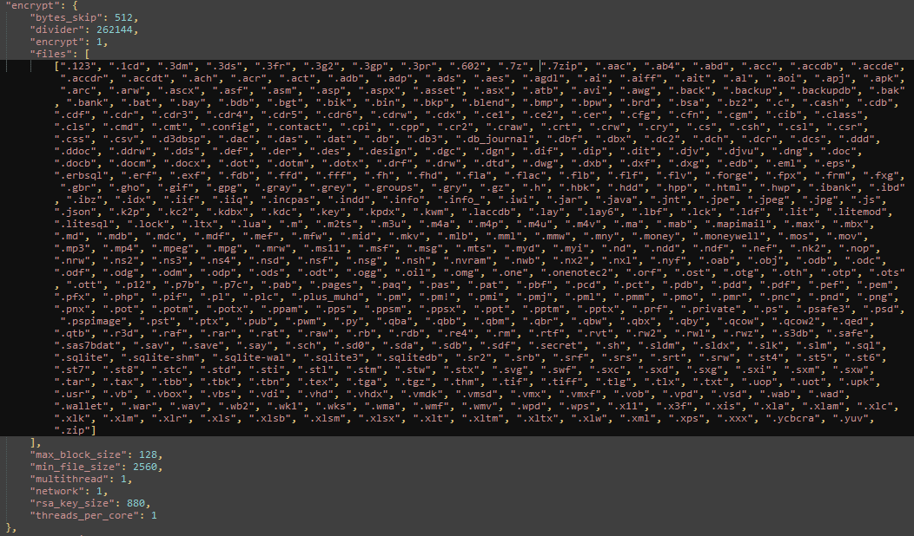

### 3.2.4 RSA公钥
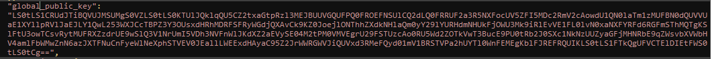
内容是经过了Base64加密后的内容，结果也验证猜想正确。下面是解密后的内容：
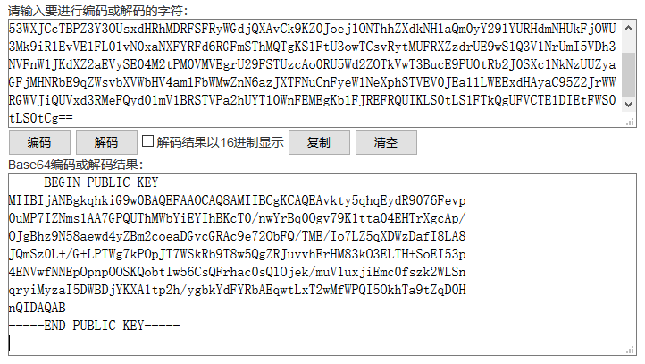

### 3.2.5 用户提示
这里有及部分组成，分别是语音提醒，壁纸更换提醒以及用户引导操作帮助文件，这里看出作者实在实在是用心良苦啊。
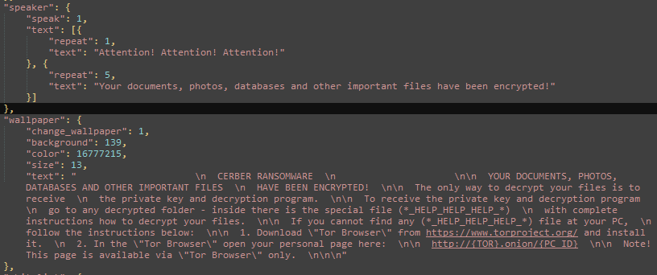
帮助文件也是使用了Base64进行了加密，解密后内容是HTML文件，具体样式如下：

### 3.2.6 服务器
服务器这块有两部分，一部分是接收感染主机的信息和通知。另外一部分是给用户用于交付勒索款的。
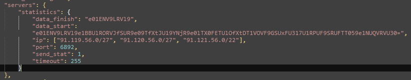
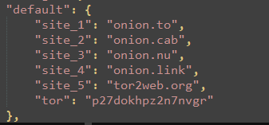

### 3.2.7 白名单
特别关照的目录。
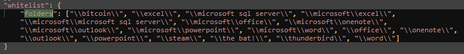

## 3.3 读取机器信息
### 3.3.1 读取机器的GUID
病毒从注册表的HKEY_LOCAL_MACHINE\SOFTWARE\Microsoft\Cryptography中读取值名称为MachineGuid的值，本测试机器的GUID值为：
98abd045-77bf-4e0f-b5d2-3c805156c566
这里的以‘-’为分隔符，前4个字符串都有特定的用途：
> 1. 病毒创建临时目录%temp%\98abd045
> 2. 在前面的临时目录中创建两个文件，分别是77bf和4e0f,这两个都是后面加密算法用到的key。
> 3. b5d2作为加密文件的后缀名

### 3.3.2 读取电脑名
读取电脑名，然后和字符串CERBER_CORE_PROTECTION_MUTEX通过计算生成类似下面格式的互斥对象名：
> shell.{3817596D-ADF3-6E49-63ED-931789067A56}

## 3.4 网络信息发送
在进行加密前，会发送感染主机的信息，信息的格式见配置文件的data_start，同样使用了Base64进行加密，解密后内容如下：
{MD5_KEY}{PARTNER_ID}{OS}{IS_X64}{IS_ADMIN}{COUNT_FILES}{STOP_REASON}{STATUS}
测试环境win7 32位系统生成的内容如下：
"e80ab90e699a  00064  7  0  1  0  0  0"

| 格式标识  | 含义  | 长度(单位:字节) |
| ------------ | ------------ |
| {MD5_KEY}  |  77bf.tmp文件内容的MD5值的前面一部分 | 12|
| {PARTNER_ID}  |  不明（内容固定） | 5|
| {OS}  | 操作系统版本  |1|
| {IS_X64}  | 是否64位系统  |1|
| {IS_ADMIN}  | 是否Administrator用户  |1|
| {COUNT_FILES}  | 可感染文件总数  |1|
| {STOP_REASON}  |  不明(内容固定) |1|
| {STATUS}  | 有枚举主机用户信息，具体代表啥没细看|1|

然后会对上面的字符串进行MD5加密，得到的MD5串为：
808A4018E134F0629A88F82940969DF9
然后取前2字节'80',作为校验码，服务器使用它来验证收到上面部分的正确性，合成字符串'e80ab90e699a0006470100080'发送为服务器。

## 3.5 加密模块
### 3.5.1 加密文件名
文件文件名是由一个函数统一生成的，和原始文件并没有任何规律可言，后缀是3.3.1中所说的GUID的第4部分，本测试机为b5d2.

### 3.5.2 加密文件内容
从配置信息加载扫描配置，然后对每个磁盘创建一个扫描线程，获取符合加密条件的文件列表。
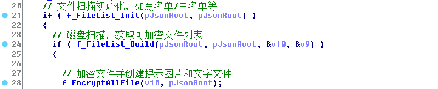

接着准备加密了，在加密之前会针对机器情况调整加密线程数，同时关闭部分进程，保证加密的运行。
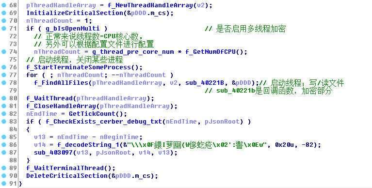

接下来就是文件加密，加过过程有点蛋疼。

为了减少码字，我画了一张渣渣图，思路大致是清楚的。
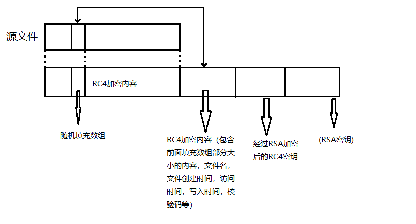

# 4. 总结
嗯，这种加密的病毒感觉真蛋疼。

------------

