# 0x0分析目标

详细分析病毒的行为和目的，编写出专杀工具以及修复工具

# 0x1 信息收集
## 1.1 哈希值

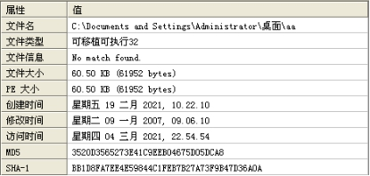 

## 1.2 查壳

根据PEid分析结果得知，该软件没有加壳，程序是使用delphi编写的。

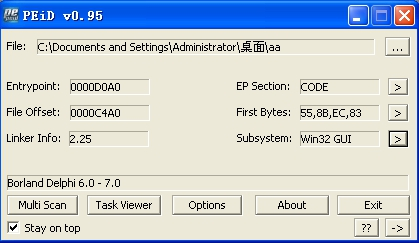 

# 0x2 分析环境及工具

测试环境：vmware + Windows XP

分析工具：IDA pro、OD、PEiD等。

# 0x3 具体行为分析
## 3.1 主要行为

病毒运行后，会伪装成系统的spcolsv.exe进程，并修改注册表，达到启动运行和隐藏自身的目的，然后会对电脑的全盘文件进行扫描，然后系统的可执行文件和网页文件进行传播。除此之外，通过139/445端口，尝试弱密码登录，进行网络传播。另外，该病毒还会从网络上下载其他恶意软件或者广告软件，达到制作者的目的。

## 3.2 程序对用户造成的危害

全盘文件感染和gho备份删除并感染其他网络主机。

## 3.3 恶意代码分析

核心功能主要由三个函数进行实现，下面进行详细分析。

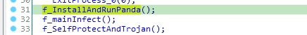 

## 3.2 安装和运行部分

检测当前目录是否存在Desktop_.ini文件，如果存在则删除，该文件保存病毒感染当前目录的日期。

接着，病毒会通过检查文件路径、病毒感染标志来确定进当前病毒属于以下三种情况的哪一种情况。进程本身属于原始病毒文件、被感染的可执行文件、以及伪装目标进程三种情况。

- 原始病毒文件

拷贝自身到 ~/system32/driver/目录，重命名为spcolsv.exe并运行，然后结束当前进程。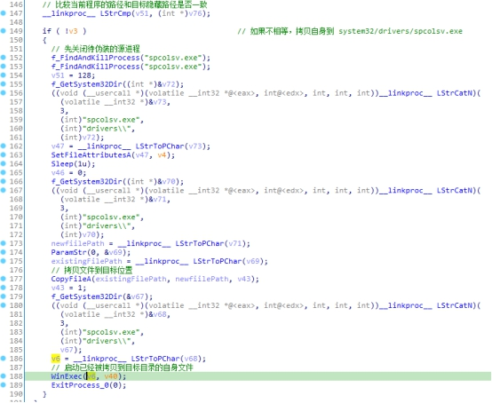

- 被感染的可执行文件

1）在当前目录释放被感染的原始文件

2）创建自删除批处理，并运行

3）拷贝病毒部分到到系统目录，伪装系统服务。

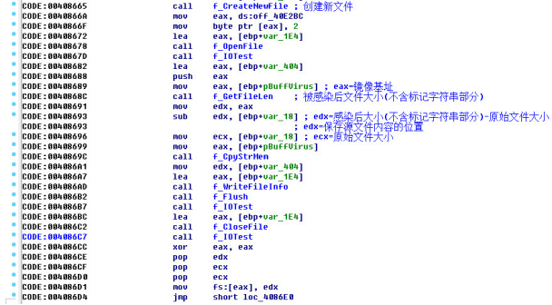 

- 伪装的目的进程文件

继续执行其他模块功能。

## 3.3 感染部分

接下来就是感染其他文件或者感染其他主机，病毒会通过本地文件感染、U盘自动感染以及网络三种方式进行传播。同时，为了防止电脑用户对系统进行还原，在查找到.gho文件时，会对其进行删除。

### 3.3.1 感染本地文件部分

创建一个线程，遍历所有的磁盘和文件，对不同类类型文件进行处理。

#### 1 删除GHO文件

防止用户利用GHO文件进行系统恢复。

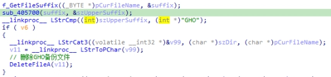 

#### 2 感染可执行文件

感染目标文件后缀类型有：EXE、SCR、PIF、COM

具体感染请参考感染后的文件格式。感染完毕后，会在当前目录中创建Desktop_.ini，并写入日期（年-月-日），当病毒二次扫描到该目录时，会对当前日期和文件内的日期进行比较，如果时同一天就不再感染当前目录了。

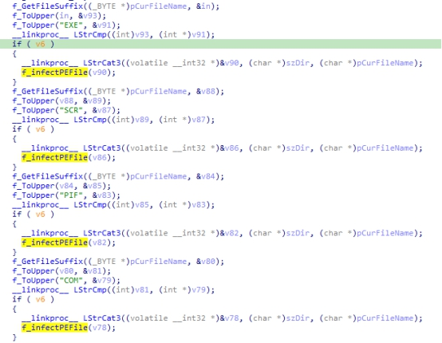 

- 病毒的感染标识

感染PE文件后，会在文件的末尾写上标志，格式为：

WhBoy+ 源文件名 + 0x2标记 + 源文件大小+0x1标记

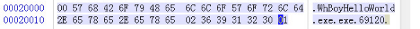 

- 感染文件结构

病毒文件 + 原始文件 + 标记字符串

#### 3 感染web文件

感染目标文件后缀类型有：htm、html、asp、php、jsp、aspx

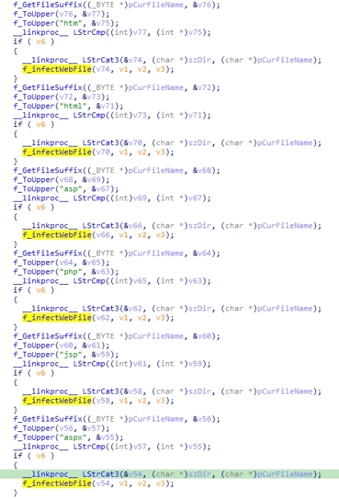 

在web文件最后加上一句，该内容在文件中是加密的，解密后在写入文件末尾：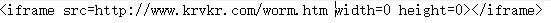

### 3.3.2 磁盘传播

通过SetTimer，每间隔6s复制自身所有磁盘的根目录，将病毒文件赋值到每个磁盘根目录并重命名为setup.exe。然后写入autorun.inf，注意这两个文件都是隐藏了。

### 3.3.3 网络传播

利用弱密码通过139/445端口进行登陆。

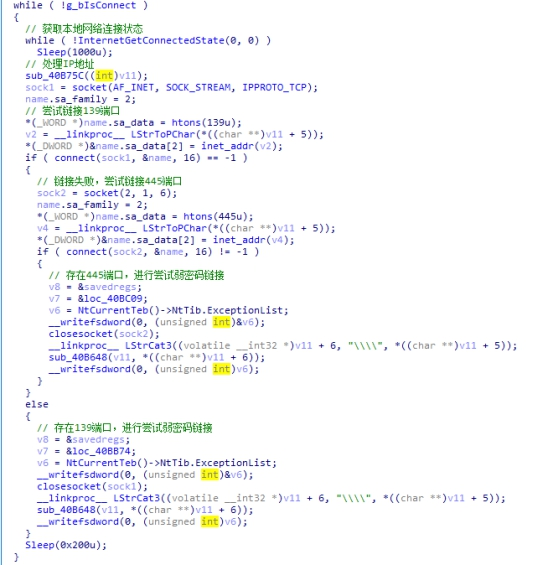 

## 3.4 自我保护部分

这部分通过设定4分不同时长的定时器进行，然后定时执行下面几种操作。

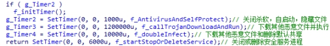 

### 3.4.1 杀进程和自启动

l 遍历进程和窗口，关闭特定杀毒软件或系统工具等

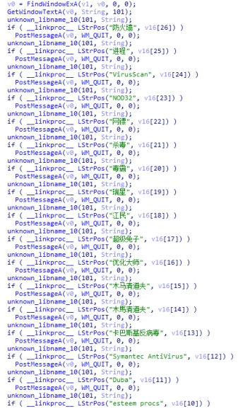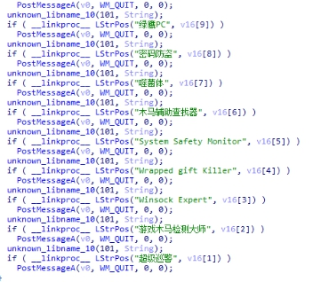 

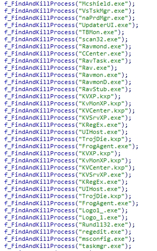 

l 设定自启动和隐藏文件

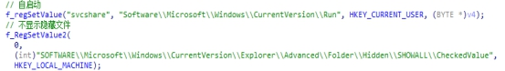 

### 3.4.2 从网络下载其他恶意软件

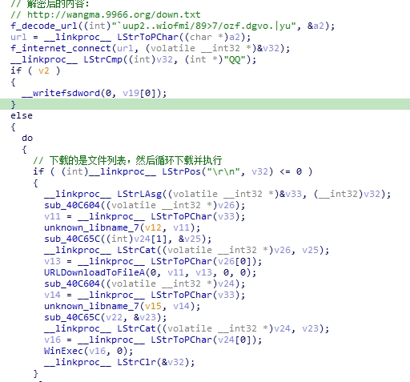 

### 3.4.3 关闭默认共享

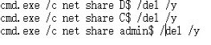 

### 3.4.4 关闭杀毒软件等服务

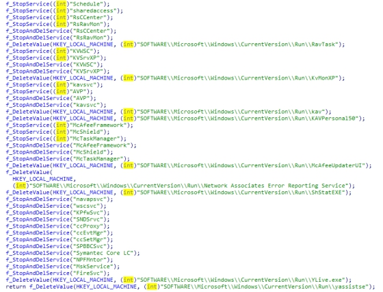 

# 0x4 解决方案
## 4.1 预防措施

毕竟是很老的病毒了，安装防火墙杀毒软件，不要使用弱密码。

## 4.2 手工查杀

## 4.3 编写专杀工具

编写一个程序，遍历文件，如果是可执行文件，则检查标志字符串，如果是被感染文件则还原原始文件，如果是web文件，则删除最后一个iframe。